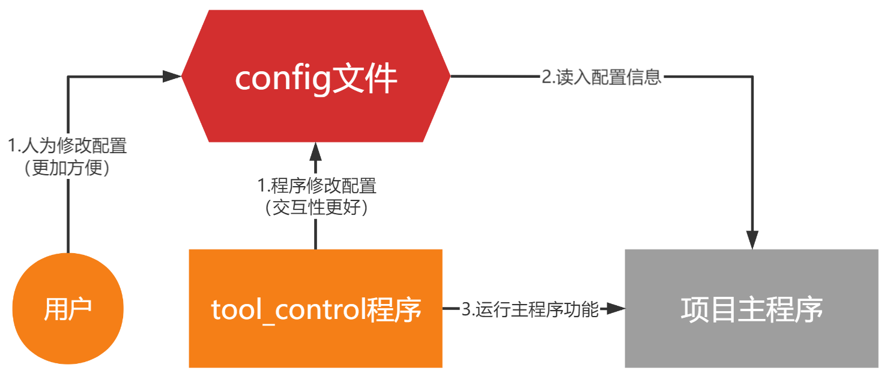

# Tool_control

## 1.总体架构



----

**成员介绍**

* 1、项目主程序是整个项目的主体，功能的具体实现在项目主程序中实现。

* 2、config文件内包含了主程序的主要运行参数，项目主程序在运行前需要读入config文件的参数。
* 3、tool_control程序是控制与修改配置的总程序，他可以对config文件进行修改，并运行主程序的所有功能。

**流程介绍** 

* 1、通过tool_control修改config文件。（用户也可以人为打开config文件直接修改）
* 2、项目主程序加载config文件。
* 3、通过tool_control运行主程序的功能。


## 2、如何开始使用

**环境信息**

* 目前只支持Linux下运行，部分功能windows与mac不兼容，无法运行

* 目前只支持python3.6

* 确保pip版本为8.1.1
  
   ```
   pip install pip==8.1.1
   ```

**依赖安装**

* requirements.txt在根目录的pip_requirements文件夹下，安装依赖可以用以下命令：

  ```
  pip install -r pip_requirements/requirements.txt
  ```

* 此外，还需要单独安装Lief库0.7.0版本，项目中已有下载的压缩包，可用以下命令安装：

  ```
  pip install pip_requirements/linux_lief-0.7.0_py3.6.tar.gz
  ```

**如何开始**

* actions中，有两个修改操作需要赋予权限，可以用以下命令运行：

  ```
  cd portable-executable/
  chmod 777 project-add-sections/bin/Debug/project-append-section
  chmod 777 project-add-imports/bin/Debug/project-append-imports
  ```

* tool_control.py是运行项目的主要控制程序，可以用以下命令运行：

  ```
  python tool_control.py
  ```

  

## 3、功能介绍


**总体介绍**

+++

 运行tool_control.py后，可以看到如上的menu，为项目的三大主要功能，其中：

* 1、用于训练一个初始的恶意样本检测模型
* 2、用于训练一个基于零和博弈和双代理的强化学习模型

* 3、运用virustotal网站的API上传恶意样本或下载恶意样本的报告

### 3.1训练一个初始恶意样本检测模型


**在命令行中输入1后将进入上图的界面**

* 配置信息：

+++

| 1.model  |  2.batch_size  | 3.test_size  |    4.val_size    |     5.max_seq_len      |     6.malware_dir      |
| :------: | :------------: | :----------: | :--------------: | :--------------------: | :--------------------: |
| 模型选择 | 每批训练的大小 | 测试样本比例 | 交叉验证样本比例 | 网络中最大字节输入数量 | 恶意样本集所在的文件夹 |

|      7.benign_dir      |  8.lr  |     9.device     | 10.num_epochs |    11.patience     |
| :--------------------: | :----: | :--------------: | :-----------: | :----------------: |
| 良性样本集所在的文件夹 | 学习率 | GPU或CPU运行程序 |   训练轮数    | 训练的重要参数之一 |


* 功能1：修改配置信息

+++


选择功能**1.Change config.**之后，在上述方框中输入需要修改的配置序号即可对配置信息进行修改。同时可对根文件夹下的pesidious.config中[Detect_train_message]部分进行修改。


* 功能2：根据配置信息训练一个新的模型

+++

选择功能**2.Train an new model.**后，主程序会加载配置信息，进入以下界面后，说明运行成功：


训练完成后，模型将被保存在文件夹./Detect_checkpoints中。


* 功能3：在已训练的模型上继续训练

+++

选择功能**3.Train an old model.**后，将会进入以下界面，需要选择一个文件夹./Detect_checkpoints下的已训练模型供后续训练需要。


选择完已训练的模型后，开始后续的追加训练，出现以下界面表示成功：


* 功能4：获取测试样本的预测准确度

+++

选择功能**4.Get the test sample detect accuracy.**后，将会进入以下界面，需要选择一个文件夹./Detect_checkpoints下的已训练模型供后续的预测工作需要。


等待一段时间后，将会得到结果：


* 功能5：预测单个文件

+++

选择功能**5.Pridict a file.**后，会进入已训练模型的选择，过程同功能4。选择完成后，需要输入待检测样本路径和文件名，得到结果。


## 3.2 训练一个基于零和博弈和双代理的强化学习模型


**在命令行中输入1后将进入上图的界面**

* 配置信息：

+++

|  1.rl_gamma  |   2.seed   | 3.rl_episodes  |     4.rl_mutations      | 5.rl_save_model_interval |
| :----------: | :--------: | :------------: | :---------------------: | :----------------------: |
| 强化学习参数 | 随机数种子 | 强化学习总轮数 | 强化学习中最大actions数 |    保存模型的间隔轮数    |

| 6.rl_output_directory |     7.device     |     8.max_seq_len      | 9.replay_buffer_size | 10.threshold |
| :-------------------: | :--------------: | :--------------------: | :------------------: | :----------: |
| 强化学习的输出文件夹  | GPU或CPU运行程序 | 网络中最大字节输入数量 |      经验池大小      |   判断阈值   |

| 11.malware_dir | 12.benign_dir  | 13.model             | 14.strategy | 15.detect_model  |
| -------------- | -------------- | -------------------- | ----------- | ---------------- |
| 恶意样本文件夹 | 良性样本文件夹 | 已训练检测模型的名字 | 策略函数    | 已训练的检测模型 |


* 功能1：修改配置信息

+++

选择功能**1.Change RL train config.**之后，在上述方框中输入需要修改的配置序号即可对配置信息进行修改。同时可对根文件夹下的pesidious.config中[RL_train_massage]部分进行修改。


* 功能2：修改选用actions列表

+++


选择功能**2.Edit actions list.**之后，可以对已选的action列表进行增删操作。进入界面后可以选择以下两个选项，其中**1.Remove an action.**功能为删除一个已选action，选中该操作后，只需要输入对应action的序列号即可删除。


**2.Add an action.**功能为在所有action列表中添加一个新的action，进入界面后只要输入所有action列表中，只要选择其中action的序列号即可添加。


* 功能3：根据配置信息训练一个新的模型

+++

选择功能**3.Train an new model.**后，主程序会加载配置信息，开始训练一个新的模型。值得注意的是：

​	- 若配置文件中 pattern = Double_agent ，则会启动双代理模式（启用检测代理）。

​    - 若配置文件中 pattern = Single_agent ，则会启动双代理模式（启用检测代理）。

****


* 功能4：根据已有强化学习模型修改样本

+++

选择功能**4.Mutate malware samples.**后，会进入模型修改界面。进入界面后可以选择以下两个选项，其中**1.Change mutate config.**功能为修改配置。


**2.Start mutate single file.**功能为修改单个文件。

**3.Start mutate dir files.**功能为修改配置中文件夹下的所有文件。


## 3.3 运用virustotal网站的API上传恶意样本或下载恶意样本的报告


**在命令行中输入1后将进入上图的界面**

* 配置信息：

-----

| 1.save_interval_id | 2.save_interval_res  | 3.result_log | 4.plainid_log | 5.create_new_log |
| :----------------: | :------------------: | :----------: | :-----------: | :--------------: |
| 检测id打印日志间隔 | 检测报告打印日志间隔 | 检测报告日志 |  检测id日志   | 是否新建日志标志 |


* 功能1：修改配置信息

----


选择功能**1.Change config.**之后，在上述方框中输入需要修改的配置序号即可对配置信息进行修改。同时可对根文件夹下的pesidious.config中[virustotal_detect]部分进行修改。


* 功能2：上传文件

---

选择功能**2.Upload dir files.**后，将会进入以下界面，输入一个恶意软件文件夹，工具将会批量上传文件夹中的文件。


运行过程如下图所示，可以看到工具首先将要上传的文件以列表形式打印出来，以进度条形式表示上传进度。


* 功能3：继续上次的文件上传

---

选择功能**3.Continue upload process.**后，工具读取配置文件[plainid_log]参数的日志文件查询已经上传的文件列表后，继续下载还没有上传的文件。


* 功能4：下载已上传文件的报告

---


选择功能**4.Download results.**后，工具读取配置文件[plainid_log]参数的日志文件查询已经上传的文件列表，根据id,对这些文件的报告进行下载。


* 功能5：继续下载文件的报告

---

由于下载可能会因为各种问题中断，所以需要功能**5.Continue download results.**来继续中断的下载，工具读取配置文件[plainid_log]参数的日志文件查询已经上传的文件列表，根据id,对这些文件中还未下载的报告进行下载。


注：将上传和下载报告分开的原因是virustotal网站对新上传恶意软件的分析需要一定的时间，如果没有分析完成就进行下载，报告中的结果为空。


## 4.一些重要文件的位置与修改

* ./tool_control.py : 整个项目的控制器交互界面。
* ./pesidious.config:整个项目的配置文件。
* ./Detect_train:项目的原始分类器训练的代码文件夹。
* ./classifier_code:项目的检测代理部分代码的文件夹。
* ./Data:项目的样本集文件夹。
* ./rl_train.py:项目的强化学习功能主体部分。
* ./util.py:项目的强化学习功能的一些函数。
* ./strategy.py:项目强化学习功能的策略函数部分，可在其中添加更多的策略函数。
* ./Detect_models.py:检测代理的模型信息。
* ./gym_malware/envs/malware_score_env.py:项目中强化学习环境的主要代码。
* ./gym_malware/envs/controls/manipulate2.py: 项目的actions函数的主体部分，可在其中添加更多的修改操作actions。
* ./gym_malware/envs/utils/interface.py:用于配置强化学习环境的检测器。